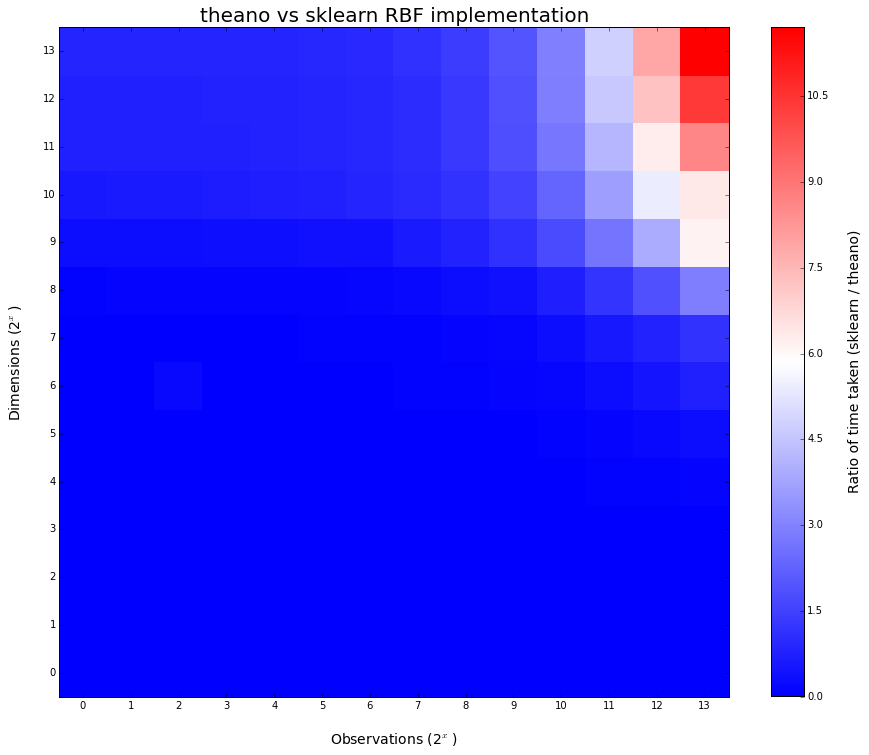
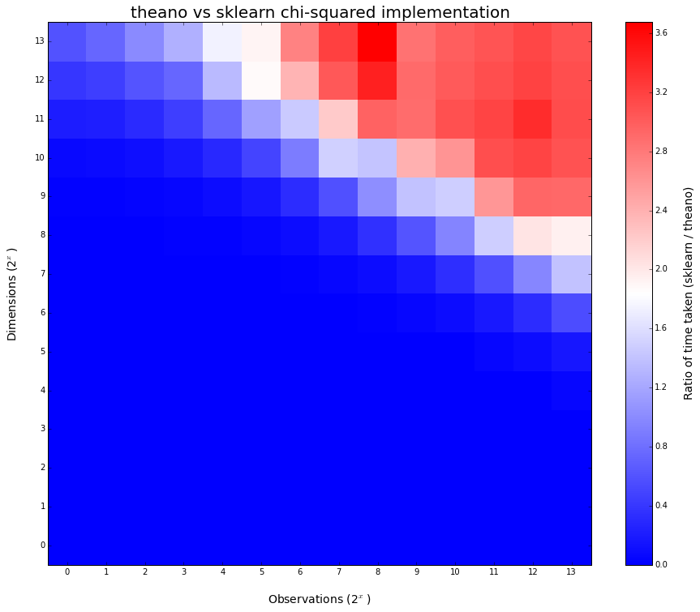

##Theano implementations of common kernel functions
Takes advantage of faster element-wise (esp. dot-product) calculations on GPU.  
Currently implements: 
RBF 
Chi^2 
Polynomial  
Requires: 
numpy 
Theano 
###Benchmarking vs sklearn.metrics.pairwise implementations
Experiments carried out on Intel Xeon W3520 CPU and GeForce 560 Ti GPU    
  
